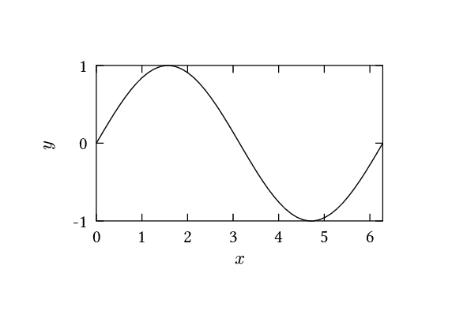
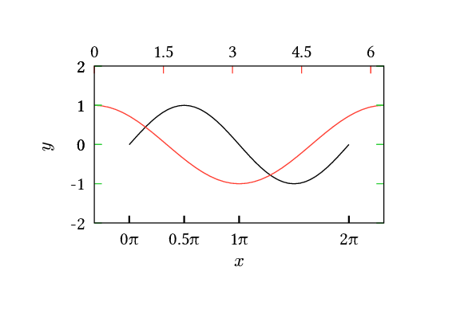
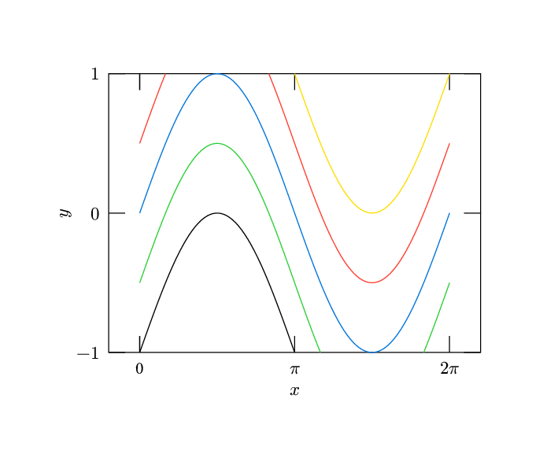
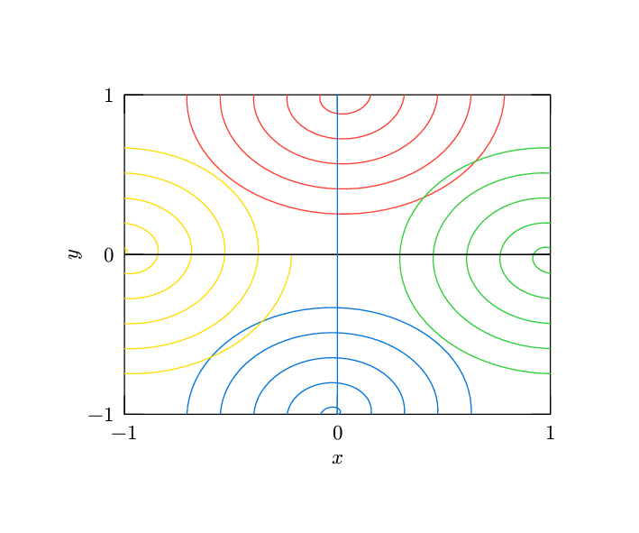

# Typst Plotting Library
A simple [Typst](https://typst.app) library for plotting line charts.

## Getting Started

```typst
#import "plot.ty": plot, plot-data
#import "plot-sample.typ": *

#plot(sample(x => calc.sin(x), min: 0, max: 2 * calc.pi))
```

## Examples




