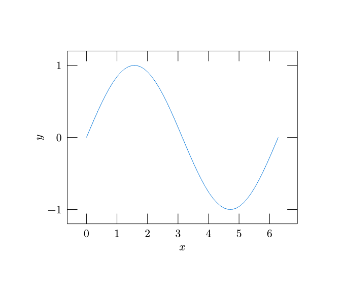
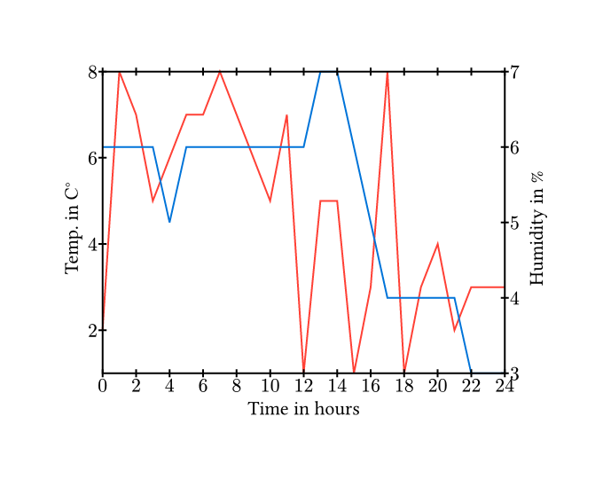
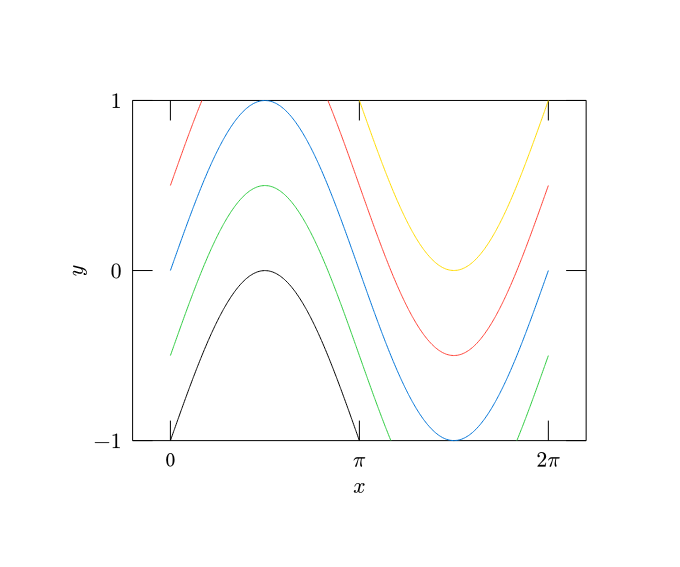
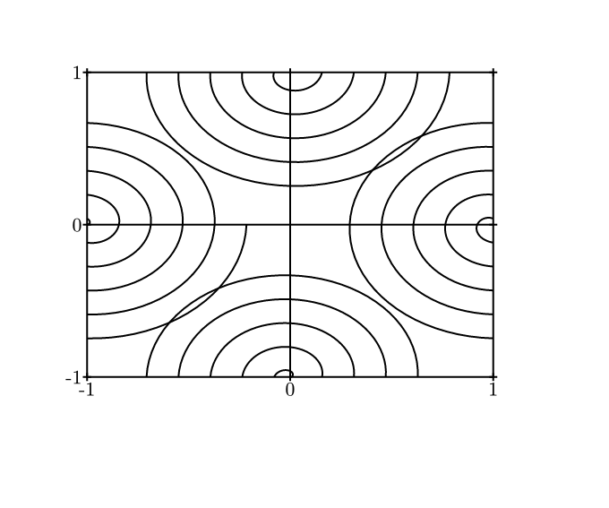

# Note
**I have implemented improved plotting in [CeTZ](https://github.com/johannes-wolf/typst-canvas)'s "plot" library. This package will not receive any new features. Please use CeTZ as an replacement for typst-plot.**
Examples of CeTZ plot and chart capabilities can be found here:
- [CeTZ main page](https://github.com/johannes-wolf/typst-canvas)
- [CeTZ manual](https://github.com/johannes-wolf/typst-canvas/blob/master/manual.pdf?raw=true)
- [CeTZ plot test image](https://github.com/johannes-wolf/typst-canvas/blob/master/tests/plot/ref.png)
- [CeTZ chart test image](https://github.com/johannes-wolf/typst-canvas/blob/master/tests/chart/ref.png)

# Typst Plotting Library
A simple [Typst](https://typst.app) library for plotting line charts.

## Getting Started

```typst
// Install the package locally by running `just install`
#import "@local/typst-plot:0.0.1": plot, sample

#plot(sample(x => calc.sin(x), min: 0, max: 2 * calc.pi))
```

## Examples
<table><tr>
  <td>
    <a href="gallery/simple.typ">
      
    </a>
  </td>
  <td>
    <a href="gallery/multi.typ">
      
    </a>
  </td>
  <td>
    <a href="gallery/tic-label.typ">
      
    </a>
  </td>
</tr><tr>
  <td>Simple Plot</td>
  <td>Multiple Plots</td>
  <td>Custom Tick labels</td>
</tr><tr>
  <td>
    <a href="gallery/parametric.typ">
      
    </a>
  </td>
  <td></td>
  <td></td>
</tr><tr>
  <td>Parametric</td>
  <td></td>
  <td></td>
</tr></table>

*Click on the example image to jump to the code.*
