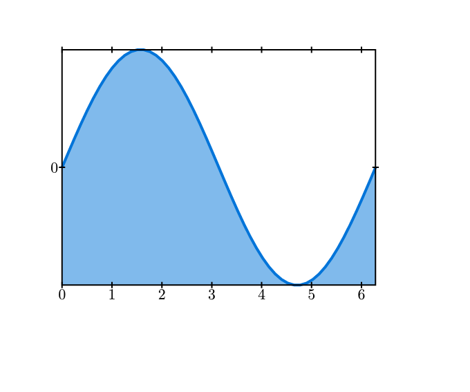
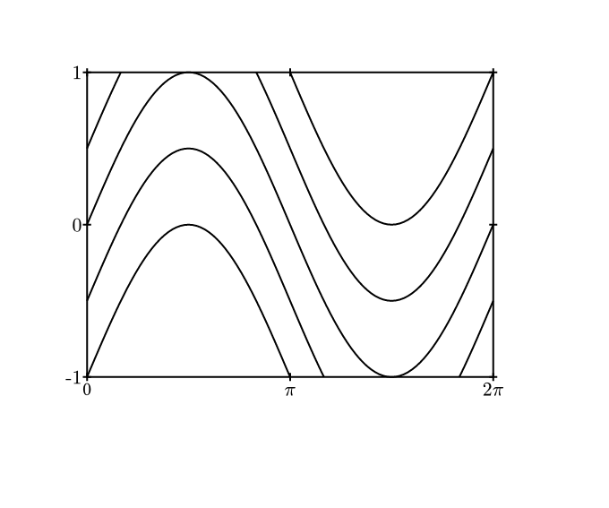

# Typst Plotting Library
A simple [Typst](https://typst.app) library for plotting line charts.

## Getting Started

```typst
// Install the package locally by running `just install`
#import "@local/typst-plot:0.0.1": plot, sample

#plot(sample(x => calc.sin(x), min: 0, max: 2 * calc.pi))
```

## Examples
<table><tr>
  <td>
    <a href="gallery/simple.typ">
      
    </a>
  </td>
  <td>
    <a href="gallery/multi.typ">
      
    </a>
  </td>
  <td>
    <a href="gallery/tic-label.typ">
      
    </a>
  </td>
</tr><tr>
  <td>Simple Plot</td>
  <td>Multiple Plots</td>
  <td>Custom Tick labels</td>
</tr><tr>
  <td>
    <a href="gallery/parametric.typ">
      
    </a>
  </td>
  <td></td>
  <td></td>
</tr><tr>
  <td>Parametric</td>
  <td></td>
  <td></td>
</tr></table>

*Click on the example image to jump to the code.*
